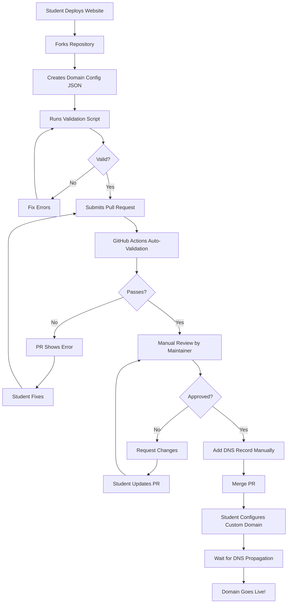
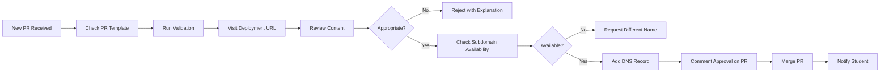
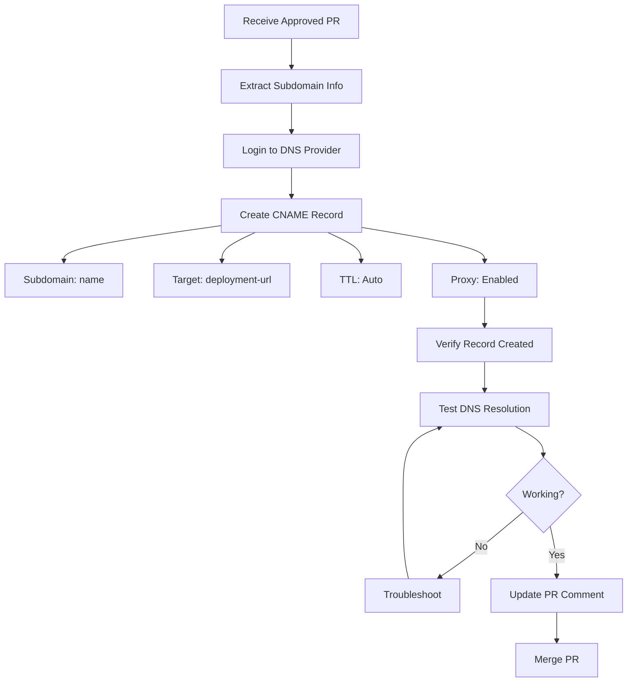
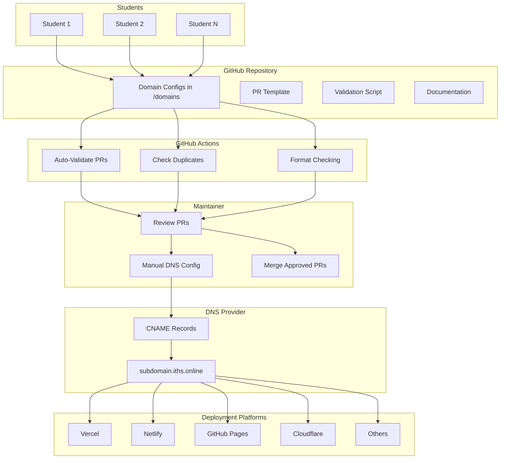

# 🔄 Workflow Diagram

## Student Submission Flow



## Maintainer Review Process



## DNS Configuration Flow



## Complete System Architecture



## File Structure Flow

```
Repository Root
│
├── .github/
│   ├── CODEOWNERS → Defines who must review PRs
│   ├── ISSUE_TEMPLATE/ → Templates for support
│   ├── PULL_REQUEST_TEMPLATE/ → PR submission form
│   └── workflows/ → Automated validation
│
├── docs/ → Platform-specific guides
│   ├── getting-started.md → Main tutorial
│   ├── vercel.md → Vercel deployment
│   ├── netlify.md → Netlify deployment
│   ├── github-pages.md → GitHub Pages setup
│   ├── cloudflare-pages.md → Cloudflare setup
│   ├── render.md → Render deployment
│   └── other-platforms.md → Other platforms
│
├── domains/ → All domain configurations
│   ├── README.md → Directory guide
│   ├── examples/ → Sample configs
│   └── student-name.json → Actual submissions
│
├── scripts/
│   └── validate.py → Validation tool
│
├── CONTRIBUTING.md → How to contribute
├── LICENSE → MIT License
├── MAINTAINER_GUIDE.md → DNS config guide
├── QUICKSTART.md → Quick reference
├── README.md → Main documentation
└── PROJECT_SUMMARY.md → Setup complete guide
```

## Timeline

```
Day 0: Student deploys website
         ↓
Day 1: Student submits PR
         ↓
Day 1-2: Automated validation runs
         ↓
Day 1-2: Manual review (24-48 hours)
         ↓
Day 2: DNS record added
         ↓
Day 2-3: DNS propagation (up to 48 hours)
         ↓
Day 3+: Domain is live and working!
```

## Key Interactions

### Student ↔ Repository
- Fork repo
- Create domain config
- Submit PR
- Respond to review comments

### Repository ↔ GitHub Actions
- Trigger validation on PR
- Check format and duplicates
- Report results

### Maintainer ↔ Repository
- Review PRs
- Validate content
- Add DNS records
- Merge approved PRs

### DNS Provider ↔ Deployment Platform
- CNAME points to deployment URL
- SSL/TLS handled by platform
- Traffic routed through DNS

---

This system ensures:
✅ Quality control through validation
✅ Manual review for safety
✅ Clear documentation for users
✅ Automated checks where possible
✅ Scalable process for growth
